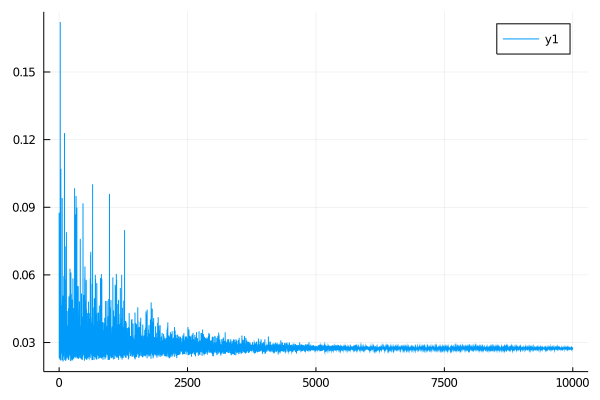

# Solving Circular Dichroism Spectra With an Evolutionary Hill Climbing Algorithm

[Hill-climbing](https://en.wikipedia.org/wiki/Hill_climbing) is probably the first algorithm you'll encounter in an introductory evolutionary algorithms or optimization course. In short, the algorithm consists of:

```
Guess solution
Do Until solution is good enough or you use up your budget:
	If solution is the best so far, keep it.
	Make a random change to the best solution. 
```

I wrote a hill-climbing algorithm back in 2010 to solve [circular dichroism](https://en.wikipedia.org/wiki/Circular_dichroism) spectra acquired in a laboratory course on protein structure while I was an undergraduate. This wasn't called for in the course assignment, and it was perhaps my first 'machine learning' project.

Attempting a facsimile of quantitative analysis for an otherwise qualitative assignment involved manually discretizing a printout of reference and experimental spectra and writing the aforementioned algorithm in MATLAB, the results of which I later used in a graded laboratory report. Despite going above and beyond the report prompt (paraphrasing here, but essentially "make up am explanation for the experimental results"), unfortunately I got a 'B' on the project because my algorithm found a solution with too much random coil for the TA's taste. The conflict between accepted norms in molecular biology relying on 'gut feeling' and technical counterpoints based on 'numbers' being disdained would be a bit of a plague on the rest of my academic career in molecular biology, but that's a story for another time.

Anyway, recently I dusted off the bits containing my old algo and re-wrote the original MATLAB script in Julia. This page is a memorial to that original algo. The results of both implementations can be found below. Just in case you actually read the code for either implementation, I'll note here that I tried to maintain the original 'confused yet arrogant undergraduate' spirit of the original script in the Julia implementation, and consider avoiding reading the MATLAB/Octave implementation if you are prone to headaches. 


### Results

Using my ancient, nigh-unreadable MATLAB script: 

````
alpha helix contribution %:
 28.467
beta sheet contribution %:
 50.452
random coil contribution %:
 21.081
the mean square error for the result of this composition is
 0.021616
```

<div align="center">
<br>
<br>
<em>Results using the GNU Octave/MATLAB implementation of a hill-climbing algorithm, y2-target</em>
</div>

and the results from my slick new Julia script mimicking an ancient, nigh-unreadable MATLAB script:

```
final loss after 10000 steps = 0.021621040231181776
[alpha helix, beta sheet, random coil] weights: [0.2876258598374498; 0.49957903605306814; 0.21279510410948216]
ok
```
<div align="center">
<br>

<br>
<em>y1-output from hill-climbing algorithm, y2-target</em>
</div>
